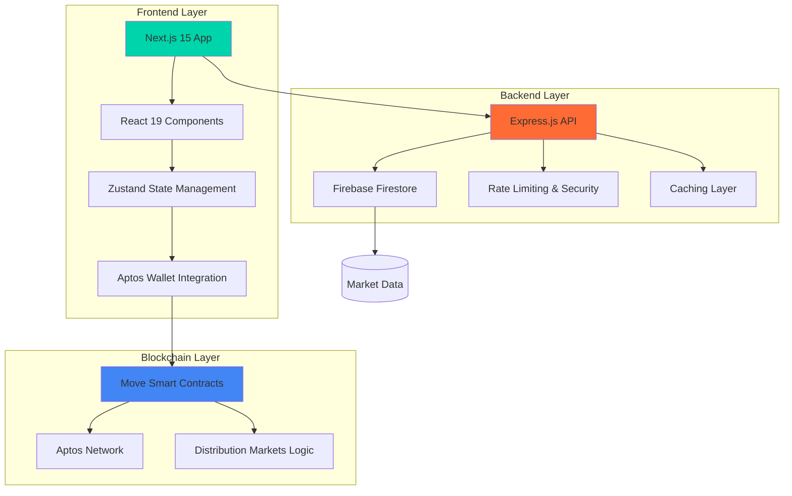

# Mirae

<div align="center">


**A next generation prediction markets platform implementing continuous probability distributions on Aptos Blockchain**

*Built on research paper from [Paradigm's Distribution Markets paper](https://www.paradigm.xyz/2024/12/distribution-markets)*

</div>

---

## 📋 Table of Contents

- [  Live Demo](#-livedemo)
- [🎯 Overview](#-overview)
- [✨ Key Features](#-key-features)
- [🏗️ Architecture](#️-architecture)
- [🚀 Quick Start](#-quick-start)
- [📡 API Reference](#-api-reference)
- [🔧 Development](#-development)
- [📊 Smart Contracts](#-smart-contracts)
- [🎨 Frontend Features](#-frontend-features)
- [🗄️ Database Structure](#️-database-structure)
- [🚀 Deployment](#-deployment)
- [🤝 Contributing](#-contributing)

---
### Live Demo

[Live Demo](https://aptos-distribution-markets.vercel.app)


## 🎯 Overview

**Mirae** is a cutting-edge prediction markets platform that implements **continuous probability distributions** for trading on future outcomes, based on [Paradigm's groundbreaking Distribution Markets research paper](https://www.paradigm.xyz/2024/12/distribution-markets). Unlike traditional binary prediction markets, this platform allows traders to express nuanced beliefs across infinite outcome ranges using normal (Gaussian) distributions.

### 📄 **Research Foundation**

This project is a complete implementation of the **Distribution Markets** concept introduced by Paradigm in December 2024. The research paper presents a novel approach to prediction markets that moves beyond binary outcomes to support continuous probability distributions, enabling more sophisticated and nuanced market predictions.

**Key Research Contributions Implemented:**
- **Continuous Case Markets**: Support for infinite outcome ranges rather than binary yes/no
- **Normal Distribution Trading**: Mathematical framework for Gaussian distribution markets
- **Liquidity Provision**: Advanced mechanisms for market makers and liquidity providers
- **Price Discovery**: Sophisticated algorithms for continuous outcome pricing

### 🌟 What Makes It Special

- **📈 Distribution Trading**: Trade on continuous probability distributions, not just binary outcomes
- **🎯 Sophisticated Modeling**: Normal distribution parameters (mean, sigma) for precise market expression  
- **📊 Research-Based**: Built on peer-reviewed academic research from Paradigm
- **⚡ Aptos Integration**: Built on Aptos blockchain for fast, low-cost transactions
- **🎨 Modern UI/UX**: Professional interface with real-time charts and interactive trading
- **🔒 Enterprise Security**: Rate limiting, input validation, and comprehensive error handling

---

## ✨ Key Features

### 🎯 **Distribution Markets**
- **Continuous Outcomes**: Trade on ranges, not just yes/no
- **Normal Distribution Modeling**: Express beliefs with mean and standard deviation
- **Interactive Charts**: Real-time distribution visualization with Chart.js
- **Advanced Trading**: Mean/sigma sliders for precise position adjustment

### 🌐 **Full-Stack Platform**
- **Next.js 15 Frontend**: React 19, TypeScript, Tailwind CSS v4
- **Node.js Backend**: Express.js API with Firebase Firestore
- **Move Smart Contracts**: Aptos blockchain integration
- **Real-time Data**: Live market updates and trading

### 🎨 **Professional UI/UX**
- **Multi-theme Support**: Green, Orange, Coral color schemes
- **Responsive Design**: Mobile-first approach with adaptive layouts
- **Search & Filtering**: Real-time market discovery
- **Wallet Integration**: Seamless Aptos wallet connection
- **Bookmarking System**: Save and manage favorite markets

### 🔐 **Enterprise Features**
- **Rate Limiting**: API protection and abuse prevention
- **Input Validation**: Comprehensive data sanitization
- **Error Handling**: Graceful error recovery and user feedback
- **Caching System**: Optimized performance with intelligent caching
- **Monitoring**: Health checks and system verification

---

## 🏗️ Architecture

<div align="center">



</div>

### 🔧 **Technology Stack**

| Layer | Technology | Purpose |
|-------|------------|---------|
| **Frontend** | Next.js 15, React 19, TypeScript | Modern web application framework |
| **Styling** | Tailwind CSS v4, Lucide Icons | Responsive design and iconography |
| **State** | Zustand, localStorage | Client-side state management |
| **Charts** | Chart.js, react-chartjs-2 | Distribution visualization |
| **3D Graphics** | Three.js | Interactive background effects |
| **Backend** | Node.js, Express.js | RESTful API server |
| **Database** | Firebase Firestore | NoSQL document database |
| **Blockchain** | Aptos, Move Language | Smart contract execution |
| **Security** | Helmet, CORS, Rate Limiting | API protection and security |

---

## 🚀 Quick Start

### 📋 **Prerequisites**

```bash
# Required
Node.js 18+ and npm
Git

# Optional (for production)
Firebase project
Aptos CLI
```

### ⚡ **One-Command Setup**

```bash
# Clone and setup entire project
git clone https://github.com/your-username/aptos_distribution_markets.git
cd aptos_distribution_markets

# Backend setup
cd backend && npm install && cp .env.example .env && npm run dev &

# Frontend setup  
cd ../frontend && npm install && cp env.example .env.local && npm run dev
```

### 🔧 **Detailed Setup**

#### **1. Backend Configuration**

```bash
cd backend
npm install
cp .env.example .env
```

**Environment Variables** (`.env`):
```env
# 🔥 Firebase (Production)
FIREBASE_SERVICE_ACCOUNT_KEY={"type":"service_account",...}
FIREBASE_PROJECT_ID=your-project-id
FIREBASE_DATABASE_URL=https://your-project.firebaseio.com

# 🚀 Server Configuration
PORT=5000
NODE_ENV=development
API_BASE_URL=/api/v1
CORS_ORIGIN=http://localhost:3000

# ⚡ Performance
CACHE_TTL=300
ENABLE_CACHE=true

# 🛡️ Security
RATE_LIMIT_WINDOW_MS=900000
RATE_LIMIT_MAX_REQUESTS=100
```

```bash
# Start backend (runs on http://localhost:5000)
npm run dev
```

#### **2. Frontend Configuration**

```bash
cd frontend
npm install
cp env.example .env.local
```

**Environment Variables** (`.env.local`):
```env
NEXT_PUBLIC_API_BASE_URL=http://localhost:5000/api/v1
NODE_ENV=development
```

```bash
# Start frontend (runs on http://localhost:3000)
npm run dev
```

#### **3. Smart Contracts (Optional)**

```bash
cd contracts

# Install Aptos CLI
curl -fsSL "https://aptos.dev/scripts/install_cli.py" | python3

# Compile contracts
aptos move compile

# Run tests
aptos move test
```

---

## 📡 API Reference

### 🎯 **Market Endpoints**

| Method | Endpoint | Description | Parameters |
|--------|----------|-------------|------------|
| `GET` | `/api/v1/markets` | List markets with pagination | `page`, `limit`, `category`, `sort`, `order` |
| `GET` | `/api/v1/markets/:id` | Get single market details | `id` (market identifier) |
| `GET` | `/api/v1/markets/search` | Search markets | `q` (search query) |
| `GET` | `/api/v1/markets/category/:category` | Filter by category | `category` (trending, crypto, politics, etc.) |
| `GET` | `/api/v1/categories` | Get all categories | None |
| `GET` | `/api/v1/health` | API health status | None |

### 📊 **Query Parameters**

```typescript
interface MarketQuery {
  page?: number;        // Page number (default: 1)
  limit?: number;       // Items per page (default: 20, max: 100)
  category?: string;    // Filter by category
  sort?: 'volume' | 'date' | 'title';  // Sort field
  order?: 'asc' | 'desc';              // Sort order
  q?: string;          // Search query
}
```

### 📝 **Response Format**

```typescript
interface ApiResponse<T> {
  success: boolean;
  data: T;
  pagination?: {
    currentPage: number;
    totalPages: number;
    totalCount: number;
    hasNextPage: boolean;
    hasPrevPage: boolean;
  };
  error?: string;
}
```

### 🎯 **Market Data Structure**

```typescript
interface Market {
  id: string;
  title: string;
  description: string;
  categories: string[];
  volume: number;
  iconName?: string;
  
  // Distribution Parameters
  mean: number;           // Expected outcome value
  standardDeviation: number;  // Distribution spread
  lambda: number;         // Liquidity parameter
  peakProbability: number;    // Maximum probability density
  headroom: number;       // Price adjustment factor
  stiffness: number;      // Market responsiveness
  
  // Market State
  isActive: boolean;
  createdAt: string;
  updatedAt: string;
  aicontext?: string;     // AI-generated context
}
```

---

## 📊 Smart Contracts

### 🔧 **Move Implementation**

The platform implements sophisticated distribution markets using Move smart contracts on Aptos, directly based on the mathematical framework presented in [Paradigm's Distribution Markets research paper](https://www.paradigm.xyz/2024/12/distribution-markets):

```move
/// Distribution Markets - Continuous Case Implementation
/// Based on the paper: https://www.paradigm.xyz/2024/12/distribution-markets
/// 
/// This module implements a prediction market for continuous probability distributions,
/// specifically focusing on normal (Gaussian) distributions. Traders can express beliefs
/// about the likelihood of different outcomes across an infinite range.
module distribution_markets::distribution_markets {
    // Core market structures and trading logic
    // Implements normal distribution probability markets
    // Supports continuous outcome ranges as defined in Paradigm research
}
```

### 🎯 **Key Contract Features**

| Feature | Description | Implementation |
|---------|-------------|----------------|
| **Market Creation** | Deploy new distribution markets | `create_market()` |
| **Position Trading** | Buy/sell distribution positions | `trade_position()` |
| **Liquidity Provision** | Add/remove market liquidity | `add_liquidity()` |
| **Market Resolution** | Resolve markets with outcomes | `resolve_market()` |
| **Fee Management** | Handle trading fees | `collect_fees()` |

### 📈 **Distribution Mathematics**

The smart contracts implement the mathematical framework from the Paradigm research paper:

```move
// Normal distribution probability density function
// Implements the continuous case mathematics from Paradigm's paper
public fun normal_pdf(x: u64, mean: u64, std_dev: u64): u64 {
    // Implements: (1/σ√(2π)) * e^(-½((x-μ)/σ)²)
    // As defined in the Distribution Markets research paper
    math_utils::calculate_normal_pdf(x, mean, std_dev)
}

// Market pricing based on distribution parameters
public fun calculate_market_price(mean: u64, sigma: u64, lambda: u64): u64 {
    // Pricing mechanism from Paradigm's continuous case framework
    math_utils::distribution_market_pricing(mean, sigma, lambda)
}
```

---

## 🎨 Frontend Features

### 🖥️ **Core Components**

| Component | Purpose | Key Features |
|-----------|---------|--------------|
| **MarketGrid** | Display markets in responsive grid | Pagination, loading states, category filtering |
| **MarketCard** | Individual market preview | Bookmarking, volume display, category tags |
| **SearchModal** | Real-time market search | Debounced search, keyboard navigation |
| **NormalDistributionChart** | Interactive distribution visualization | Chart.js integration, real-time updates |
| **CategoryNav** | Category filtering navigation | 11 categories, active state management |
| **WalletSelector** | Aptos wallet integration | Multi-wallet support, connection status |

### 🎨 **Design System**

#### **Theme Support**
```typescript
// Three professional color schemes
const themes = {
  green: { primary: '#11b881', secondary: '#22d394' },
  orange: { primary: '#e59500', secondary: '#ff9f1a' },
  coral: { primary: '#ef2d56', secondary: '#ff4d7a' }
};
```

#### **Responsive Breakpoints**
- **Mobile**: `< 768px` - Single column layout
- **Tablet**: `768px - 1024px` - Two column grid
- **Desktop**: `> 1024px` - Three+ column grid

#### **Interactive Elements**
- **Hover Effects**: Smooth transitions and color changes
- **Loading States**: Skeleton loaders and spinners
- **Error Handling**: User-friendly error messages
- **Accessibility**: ARIA labels and keyboard navigation

### 🔄 **State Management**

```typescript
// Zustand stores for different concerns
interface AppStore {
  activeCategory: string;
  searchQuery: string;
  isSearchOpen: boolean;
}

interface ThemeStore {
  currentTheme: 'green' | 'orange' | 'coral';
  toggleTheme: () => void;
}
```

---

## 🗄️ Database Structure

### 🔥 **Firestore Collections**

#### **`markets_full`** - Complete Market Data
```typescript
{
  id: string;
  title: string;
  description: string;
  categories: string[];
  volume: number;
  mean: number;
  standardDeviation: number;
  lambda: number;
  peakProbability: number;
  headroom: number;
  stiffness: number;
  isActive: boolean;
  createdAt: Timestamp;
  updatedAt: Timestamp;
  aicontext?: string;
}
```

#### **`markets_minimal`** - Optimized Listing Data
```typescript
{
  id: string;
  title: string;
  categories: string[];
  volume: number;
  iconName?: string;
}
```

#### **`categories`** - Category Metadata
```typescript
{
  id: string;
  name: string;
  displayName: string;
  marketCount: number;
  totalVolume: number;
}
```

### 🎯 **Market Categories**

| Category | Description | Example Markets |
|----------|-------------|-----------------|
| **trending** | High-volume, popular markets | Viral events, breaking news |
| **crypto** | Cryptocurrency predictions | Bitcoin price, APT token |
| **politics** | Political outcomes | Elections, policy decisions |
| **sports** | Sports betting markets | Game outcomes, championships |
| **tech** | Technology predictions | IPOs, product launches |
| **economy** | Economic indicators | GDP, inflation rates |
| **earnings** | Company earnings | Quarterly results, revenue |
| **geopolitics** | International relations | Trade deals, conflicts |
| **world** | Global events | Climate, disasters |
| **elections** | Electoral predictions | Candidate outcomes |
| **new** | Recently created markets | Latest additions |

> **📋 Complete Documentation**: See [FIREBASE_DETAILED.md](./FIREBASE_DETAILED.md) for comprehensive Firebase integration, API patterns, and troubleshooting.

---

## 🔧 Development

### 🛠️ **Backend Development**

```bash
cd backend

# Development Commands
npm run dev         # Start with nodemon (auto-reload)
npm run start       # Production start
npm run lint        # ESLint code analysis
npm test           # Jest test suite

# Database Commands
npm run seed        # Seed with basic data
npm run seed:latest # Seed from JSON file
npm run seed:all    # Seed all markets
npm run verify      # Verify database integrity
npm run verify:system # System health check
```

### 🎨 **Frontend Development**

```bash
cd frontend

# Development Commands
npm run dev         # Next.js dev server (Turbopack)
npm run build       # Production build (Turbopack)
npm run start       # Production server
npm run lint        # ESLint analysis
```

### 📊 **Smart Contract Development**

```bash
cd contracts

# Move Commands
aptos move compile  # Compile contracts
aptos move test     # Run Move tests
aptos move publish  # Deploy to network

# Testing
aptos move prove    # Formal verification
```

### 🔄 **Development Workflow**

1. **Setup Environment**
   ```bash
   # Clone and install
   git clone <repo-url>
   cd aptos_distribution_markets
   
   # Install all dependencies
   cd backend && npm install
   cd ../frontend && npm install
   cd ../contracts && aptos move compile
   ```

2. **Start Development Servers**
   ```bash
   # Terminal 1: Backend
   cd backend && npm run dev
   
   # Terminal 2: Frontend  
   cd frontend && npm run dev
   ```

3. **Database Setup**
   ```bash
   # Seed development data
   cd backend && npm run seed:all
   
   # Verify setup
   npm run verify:system
   ```

---

## 🚀 Deployment

### 🌐 **Frontend Deployment (Vercel)**

```bash
# Install Vercel CLI
npm i -g vercel

# Deploy from frontend directory
cd frontend
vercel --prod

# Environment variables needed:
# NEXT_PUBLIC_API_BASE_URL=https://your-api.com/api/v1
```

### 🔧 **Backend Deployment (Railway/Render)**

```bash
# Build for production
cd backend
npm run build

# Environment variables needed:
# FIREBASE_SERVICE_ACCOUNT_KEY=<service-account-json>
# FIREBASE_PROJECT_ID=<project-id>
# NODE_ENV=production
# PORT=5000
```

### ⛓️ **Smart Contract Deployment**

```bash
cd contracts

# Deploy to testnet
aptos move publish --named-addresses distribution_markets=<your-address>

# Deploy to mainnet
aptos move publish --named-addresses distribution_markets=<your-address> --network mainnet
```

---

## 🔒 Security & Performance

### 🛡️ **Security Features**

| Feature | Implementation | Purpose |
|---------|----------------|---------|
| **Rate Limiting** | Express rate limiter | Prevent API abuse |
| **Input Validation** | Joi schemas | Sanitize user input |
| **CORS Protection** | Configurable origins | Control access |
| **Helmet Security** | Security headers | Protect against attacks |
| **Environment Variables** | Secure config | Hide sensitive data |

### ⚡ **Performance Optimizations**

- **Caching**: In-memory caching with TTL
- **Compression**: Gzip response compression  
- **Database Indexing**: Optimized Firestore queries
- **Code Splitting**: Next.js automatic splitting
- **Image Optimization**: Next.js image optimization
- **Bundle Analysis**: Webpack bundle analyzer

---

## 🧪 Testing

### 🔬 **Test Coverage**

```bash
# Backend Testing
cd backend
npm test                    # Run all tests
npm run test:watch         # Watch mode
npm run test:coverage      # Coverage report

# Frontend Testing  
cd frontend
npm test                   # Jest + React Testing Library
npm run test:e2e          # Playwright E2E tests

# Smart Contract Testing
cd contracts
aptos move test           # Move unit tests
aptos move prove          # Formal verification
```

### 📊 **Test Types**

- **Unit Tests**: Individual function testing
- **Integration Tests**: API endpoint testing  
- **E2E Tests**: Full user workflow testing
- **Contract Tests**: Move smart contract testing
- **Performance Tests**: Load and stress testing

---

## 🤝 Contributing

### 📋 **Development Guidelines**

1. **Fork & Clone**
   ```bash
   git clone https://github.com/your-username/aptos_distribution_markets.git
   cd aptos_distribution_markets
   ```

2. **Create Feature Branch**
   ```bash
   git checkout -b feature/your-feature-name
   ```

3. **Development Standards**
   - Follow TypeScript strict mode
   - Use ESLint and Prettier
   - Write comprehensive tests
   - Update documentation

4. **Commit Standards**
   ```bash
   # Use conventional commits
   git commit -m "feat: add distribution chart component"
   git commit -m "fix: resolve category filtering bug"
   git commit -m "docs: update API documentation"
   ```

5. **Pull Request**
   - Provide clear description
   - Include screenshots for UI changes
   - Ensure all tests pass
   - Update relevant documentation

### 🏗️ **Project Structure**

```
aptos_distribution_markets/
├── 🎨 frontend/           # Next.js application
│   ├── src/
│   │   ├── app/          # App router pages
│   │   ├── components/   # React components
│   │   ├── hooks/        # Custom hooks
│   │   ├── store/        # Zustand stores
│   │   └── utils/        # Utility functions
│   └── public/           # Static assets
├── 🔧 backend/            # Node.js API server
│   ├── src/
│   │   ├── controllers/  # Route controllers
│   │   ├── services/     # Business logic
│   │   ├── middleware/   # Express middleware
│   │   └── utils/        # Helper functions
│   └── scripts/          # Database scripts
├── ⛓️ contracts/          # Move smart contracts
│   ├── sources/          # Contract source code
│   └── tests/            # Contract tests
└── 📚 docs/              # Documentation
```

---

## 📄 License

**MIT License** - See [LICENSE](./LICENSE) file for details.

---

## 🙏 Acknowledgments

- **[Paradigm](https://www.paradigm.xyz/)** - For the groundbreaking [Distribution Markets research paper](https://www.paradigm.xyz/2024/12/distribution-markets) that forms the theoretical foundation of this platform
- **[Aptos Labs](https://aptoslabs.com/)** - Blockchain infrastructure and Move language tooling
- **[Firebase](https://firebase.google.com/)** - Database and backend services
- **[Next.js](https://nextjs.org/)** - React framework and development tools

### 📄 **Research Citation**

This project implements the concepts presented in:
> **Distribution Markets**  
> *Paradigm Research, December 2024*  
> Available at: https://www.paradigm.xyz/2024/12/distribution-markets

The mathematical framework, continuous case implementation, and market mechanisms are directly based on this seminal research in prediction market design.

---

<div align="center">

**Built with ❤️ for the future of prediction markets**

[](https://github.com/your-username/aptos_distribution_markets)
[](https://twitter.com/your-twitter)

[🚀 Deploy Now](https://vercel.com/new/clone?repository-url=https://github.com/your-username/aptos_distribution_markets) • [📖 Read Docs](./FIREBASE_DETAILED.md) • [💬 Join Discord](#)

</div>