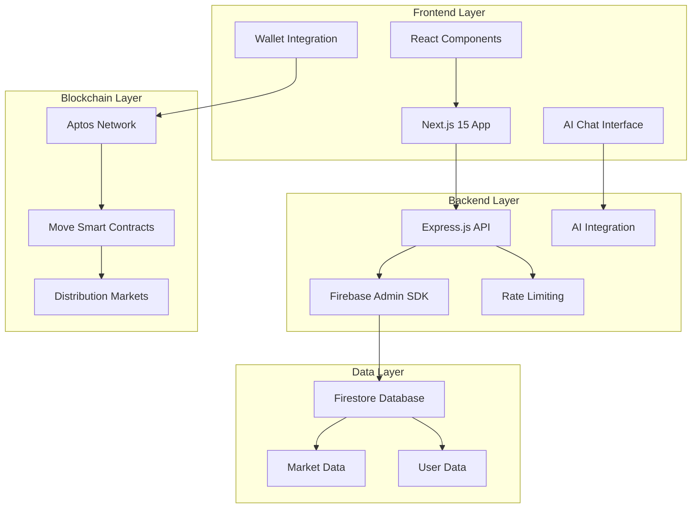

<div align="center">


**Next Generation Prediction Markets Platform on Aptos**

*From risky guesses to informed trades, capture every outcome.*

[](https://opensource.org/licenses/MIT)
[](https://aptoslabs.com/)
[](https://nextjs.org/)
[](https://www.typescriptlang.org/)
[](https://move-language.github.io/)

</div>

---

## 📋 Table of Contents

- [📋 Table of Contents](#-table-of-contents)
- [🚀 Live Application](#-live-application)
- [User Guide](#user-guide)
  - [How to Engage with the Market](#how-to-engage-with-the-market)
  - [Rewards](#rewards)
- [🌟 Overview](#-overview)
  - [🎯 Key Features](#-key-features)
- [🏗️ Architecture](#️-architecture)
- [🚀 Quick Start](#-quick-start)
  - [Prerequisites](#prerequisites)
  - [Installation](#installation)
- [📁 Project Structure](#-project-structure)
- [🔧 Technology Stack](#-technology-stack)
  - [Frontend](#frontend)
  - [Backend](#backend)
  - [Blockchain](#blockchain)
- [🧮 Mathematical Foundation](#-mathematical-foundation)
  - [Normal Distribution Parameters](#normal-distribution-parameters)
  - [Key Formulas](#key-formulas)
  - [Research Paper Implementation](#research-paper-implementation)
- [🧪 Testing Smart Contracts](#-testing-smart-contracts)
- [🙏 Acknowledgments](#-acknowledgments)


---

## 🚀 Live Application


**🔥 Try Infi Markets Now**

[](https://aptos-distribution-markets-d12b.vercel.app/)

🚨 **Website loading delay**: Render's policy of spinning down free instance with inactivity, can delay website loading by 50 seconds or more.

🚨 **Only Demo available**: Currently, only the market in **Demo** is fully functional end-to-end.

---

## User Guide

### How to Engage with the Market

1. **Select a Market**
2. **Set Your Position:** By changing the following parameters.

   * **Mean:** This represents the <u>expected value of the asset</u> in a market. 
    
        **Example:** for market *What will be price of APT by the end of December 2025*, the mean here is the expected price of APT in USD.
    
   * **Standard Deviation:** This represents your level of <u>confidence</u> in the position. A higher standard deviation indicates greater confidence, which can result in higher potential profits if the market resolves in your favor. Higher standard deviation means pointier the curve around your expected value

        **Example:** If you expect the price of APT to be $8 by the end of December 2025, you will set the mean to 8. And if you are highly confident that the price will be close to $8, you will assign a higher standard deviation, creating a pointier curve around your predicted value.

3. **Execute Trades:** After setting the mean and standard deviation, users can buy their position based on their prediction. All positions will be visible in the **Positions** section.
4. anand, ye padhle ek baar **Add Liquidity:** Users can also provide liquidity by buying the current market position.

### Rewards

* anand rewards exactly kaise mil rhe hai batadiyo, like market resolve 7 dollar pe hua, and mera difference curve ye that, to kitne apt milenge, with exmaple values
* Regardless of whether the market resolves in your favor through trade positions, users earn a **4% APY** on their positions.
* anand ye bhi batadiyo why adding the liquidity is safer option and difference kya hai manually setting the position and thorugh add liquidity se.

---

## 🌟 Overview  

**Infi Markets** is a next generation prediction market platform built on the Aptos blockchain, implementing continuous distribution markets for normal (Gaussian) probability distributions. This project is a implementation of the [Distribution Markets research paper](https://www.paradigm.xyz/2024/12/distribution-markets) by Dave White at Paradigm.

Unlike traditional binary prediction markets, Infi Markets allows traders to express nuanced beliefs about outcomes using distribution curves in virtually infinite ways. This unlocks a new dimension of prediction markets which captures the real world complex events which can't be captured by simple yes or no markets.

### 🎯 Key Features

- **📊 Continuous Distribution Markets**: Trade on normal distributions with infinite possibilities
- **🔗 Aptos Blockchain Integration**: Built on Aptos with Move smart contracts
- **🤖 AI-Powered Insights**: Integrated AI chat for market analysis, to provide guidance and knowledge to users to make smarter positions.
- **🔥 Real-time Data**: Firebase Firestore for market data
- **💼 Wallet Integration**: Seamless Aptos wallet connectivity, using Aptos Labs SDK

## 🏗️ Architecture

  



  

## 🚀 Quick Start

### Prerequisites

- **Node.js** >= 18.0.0
- **Aptos CLI** for smart contract deployment
- **Firebase Project** for database
- **OpenAI API Key** for AI features

### Installation

  

1. **Clone the repository**

```bash
git clone https://github.com/aryanbaranwal001/aptos_distribution_markets.git
cd aptos_distribution_markets
```

2. **Install dependencies**

```bash
# Backend dependencies
cd backend
npm install

# Frontend dependencies
cd ../frontend
npm install

# Smart contracts (optional)
cd ../contracts
aptos move compile
```

  

3. **Environment Setup**

**Backend (.env)**

```bash
FIREBASE_SERVICE_ACCOUNT_KEY=firebase_service_account_key_in_json
PORT=5000
NODE_ENV=development
API_BASE_URL=/api/v1
RATE_LIMIT_WINDOW_MS=900000
RATE_LIMIT_MAX_REQUESTS=100
OPENAI_API_KEY=your_openai_key
```
**Frontend (.env.local)**

```bash
NEXT_PUBLIC_API_BASE_URL=http://localhost:5000/api/v1
```

4. **Start the development servers**

```bash
# Terminal 1: Backend
cd backend
npm run dev

# Terminal 2: Frontend
cd frontend
npm run dev
```

## 📁 Project Structure


```
aptos_distribution_markets/

├── 🖥️ frontend/ # Next.js 15 React application
│ ├── src/
│ │ ├── app/ # App router pages
│ │ ├── components/ # Reusable React components
│ │ ├── data/ # Market data and types
│ │ ├── hooks/ # Custom React hooks
│ │ ├── services/ # API services
│ │ ├── store/ # Zustand state management
│ │ └── utils/ # Utility functions
│ └── public/ # Static assets and icons
│
├── 🔧 backend/ # Express.js API server
│ ├── src/
│ │ ├── config/ # Firebase configuration
│ │ ├── controllers/ # API route controllers
│ │ ├── middleware/ # Express middleware
│ │ ├── routes/ # API routes
│ │ └── services/ # Business logic
│ └── scripts/ # Database seeding scripts
│
├── 📜 contracts/ # Aptos Move smart contracts
│ ├── sources/ # Move source files
│ │ ├── distribution_markets.move # main market contract
│ │ └── math_utils.move # state of the art math utils library in move
│ └── tests/ # Contract tests
│
└── 🖼️ README.md # Project README
```

## 🔧 Technology Stack

### Frontend

- **Framework**: Next.js 15 with App Router
- **Language**: TypeScript
- **Styling**: Hybrid of Tailwind CSS and CSS
- **State Management**: Zustand
- **Charts**: Chart.js with React integration
- **3D Graphics**: Three.js
- **Wallet**: Aptos Labs Wallet Adapter

### Backend
- **Runtime**: Node.js with Express.js
- **Database**: Firebase Firestore
- **Authentication**: Firebase Admin SDK
- **Rate Limiting**: Express Rate Limit
- **AI Integration**: OpenAI API
- **Security**: Helmet, CORS

### Blockchain

- **Network**: Aptos Testnet
- **Language**: Move
- **SDK**: Aptos Labs TypeScript SDK
- **Features**: Continuous distribution markets

## 🧮 Mathematical Foundation

anand ye poora dekh liyo

Infi Markets implements the **Distribution Markets** protocol based on the [Paradigm research paper](https://www.paradigm.xyz/2024/12/distribution-markets) by Dave White. This groundbreaking research introduces a new kind of prediction market for events with continuous outcomes, using constant function AMMs over probability distributions.

  

The system uses:

  

### Normal Distribution Parameters

- **μ (Mean)**: Central tendency of the distribution

- **σ (Standard Deviation)**: Spread and uncertainty

- **λ (Lambda)**: Scaling factor for market dynamics

- **K (Invariant)**: AMM invariant constant

  

### Key Formulas

```

Position Value = λ_g * √(2πσ_g) * e^(-(x-μ_g)²/(2σ_g²))

Market Price = λ_f * √(2πσ_f) * e^(-(x-μ_f)²/(2σ_f²))

```

  

### Research Paper Implementation

This project implements the complete Distribution Markets mechanism as described in the [Paradigm research paper](https://www.paradigm.xyz/2024/12/distribution-markets), including:

  

- **Constant Function AMM**: Using l₂ norm invariant over probability distributions

- **Normal Distribution Trading**: Full implementation of Gaussian distribution markets

- **Collateralization**: Proper backing constraints and risk management

- **AMM Behavior**: Market dynamics that prevent information extraction attacks

  
  

## 🧪 Testing Smart Contracts

```bash
cd contracts
aptos move test
```
## 🙏 Acknowledgments

- **[Dave White at Paradigm](https://www.paradigm.xyz/2024/12/distribution-markets)** for the Distribution Markets research paper
- **Aptos Labs** for the blockchain infrastructure and Move language
- **Next.js Team** for the amazing React framework
- **Firebase** for the real-time database
- **OpenAI** for AI capabilities
- **Paradigm Research Team** for advancing the field of information finance
---

<div align="center">
<p><strong>Built with ❤️ on Aptos</strong></p>
<p>© 2024 Infi Markets. All rights reserved.</p>
</div>